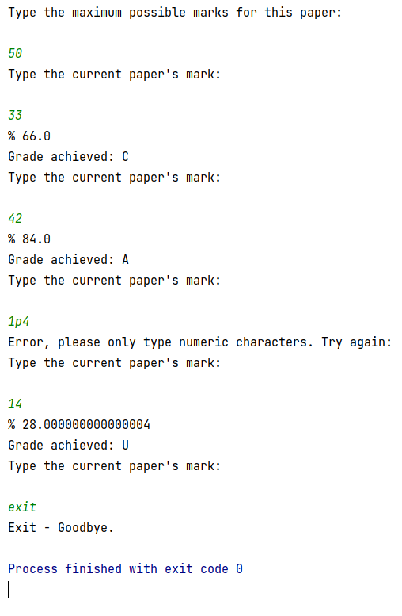

# aLevelGrader
A program to grade A Level exam papers using preset grade boundaries. 

The user first inputs the maximum mark possible, then repeatedly inputs the marks achieved for each paper. The grade achieved is output after each mark has been input.

There are checks to make sure that only numeric characters that are below or equal to the maximum mark are input.
The escape mechanism allows the user to type "exit" to exit the program.

